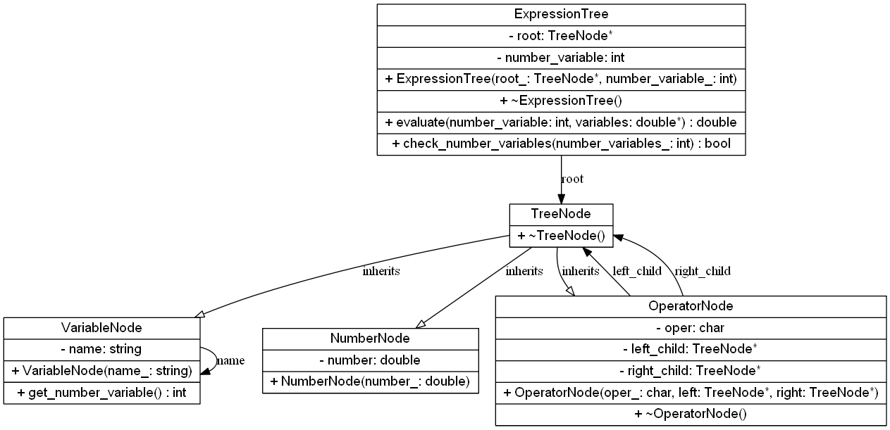

# NelderMead_dll
Проект динамической библиотеки с методом Нелдера-Мида. Собрать библиотеку возможно на любой системе. 

31.03.2025
Проект содержит реализацию динамической библиотеки NelderMead с функциями:
1. Парсинга арефмитического выражения. Строка типа C с инфиксной записью преобразовывается в дерево выражения.
2. Вычисления выражения. Выражение считается с учетом сохранённых значений переменных.

Для просмотра документации запустите файл docs/html/index.html.
Короткая информация об элементах библиотеки описана в Doc.md.

# UML дерева выражения
